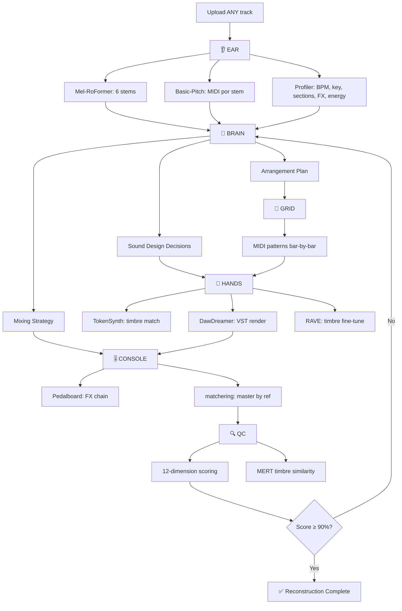

# AURALIS — Track-Agnostic Reconstruction Engine Architecture

> **Misión:** Subir CUALQUIER track → AURALIS lo deconstruye, identifica cada elemento, y lo reconstruye pieza por pieza a la misma calidad. 100% agnóstico. Cero hardcoded.

## Principio Fundamental

```
Upload ANY track → 👂 EAR deconstruye → 🧠 BRAIN analiza →
📐 GRID compone → 🎹 HANDS sintetiza → 🎚️ CONSOLE mezcla/masteriza →
🔍 QC compara A/B → ♻️ Itera hasta match
```

---

## Capa 1: 👂 EAR — Deconstrucción Inteligente

**Objetivo:** Descomponer cualquier track en sus elementos constitutivos + extraer ADN musical completo.

### 1.1 Separación de Stems

| Tecnología | SDR avg | Params | Estado |
|---|---|---|---|
| **Mel-RoFormer** | 9.96 dB | ~50M | ✅ Open source HuggingFace |
| **BS-RoFormer** | 9.80 dB | 72M×4 | ✅ Open source |
| HTDemucs v4 | 7.68 dB | — | ✅ Ya implementado |
| Moises-Light | 9.96 dB | **5M** | ✅ Más eficiente (13× menos params) |

> [!IMPORTANT]
> **Decisión:** Usar **Mel-RoFormer** como separador primario (mejor calidad). Mantener HTDemucs como fallback.
> Configurar N stems: vocals, drums, bass, other, piano, guitar (6-stem mode).

### 1.2 Extracción MIDI

| Herramienta | Capacidad |
|---|---|
| **Basic-Pitch** (Spotify) | Polifónico, multi-instrumento, pitch bend, rápido |
| **MIDI-VALLE** | Expresivo (dinámica, pedal) — piano especializado |
| musicpy | Teoría musical, análisis de progresiones |

**Pipeline:** Cada stem separado → Basic-Pitch → MIDI + detección de tonalidad/escala automática

### 1.3 Profiling Espectral (ya existe en `profiler.py`)

- RMS por sección (detectado automáticamente)
- Relación S/M (stereo width)
- Análisis de envolvente (ADSR por elemento)
- Detección de efectos (reverb time, delay, sidechain ratio, filter cutoff)
- Detección de BPM + time signature

---

## Capa 2: 🎹 HANDS — Síntesis Inteligente

**Objetivo:** Re-sintetizar cada elemento identificado usando el timbre más aproximado posible.

### 2.1 Motor de Síntesis Principal

| Herramienta | Uso |
|---|---|
| **DawDreamer** | VST host Python — carga Surge XT, Vital, cualquier VST |
| **Faust DSP** | DSP custom integrado en DawDreamer |
| **JAX + Flax** | Optimización de parámetros de síntesis ML-driven |

### 2.2 Clonación de Timbre

| Tecnología | Capacidad | Estado |
|---|---|---|
| **TokenSynth** | Zero-shot instrument cloning via codec LM | ✅ Feb 2025 |
| **RAVE** | Real-time timbre transfer, disponible como VST | ✅ Open source |
| **DDSP** (Google) | Differentiable DSP, pitch/loudness independientes | ✅ Open source |

**Pipeline por stem:**
```
Stem original → TokenSynth (identifica timbre)
                → Busca preset más cercano en banco de VSTs
                → DawDreamer renderiza MIDI con ese preset
                → RAVE ajusta timbre fino si necesario
```

### 2.3 Banco de Presets (Track-Agnostic)

En lugar de presets hardcoded, el sistema:
1. Separa stem → analiza espectro/ADSR/harmonics
2. Busca en **banco genérico** de presets VST (Surge XT, Vital)
3. Si no hay match suficiente → TokenSynth genera timbre zero-shot
4. DawDreamer + JAX optimizan parámetros del VST para acercarse al original

---

## Capa 3: 🎚️ CONSOLE — Mezcla y Master

**Objetivo:** Mezclar stems reconstruidos y masterizar por referencia al original.

### 3.1 Cadena de Efectos

| Herramienta | Uso |
|---|---|
| **Pedalboard** (Spotify) | EQ, comp, reverb, delay, chorus, limiter |
| Sidechain custom | Pump automático detectado del original |
| Stereo width matcher | Replica S/M ratio por sección |

### 3.2 Mastering por Referencia

| Herramienta | Capacidad |
|---|---|
| **matchering** | Match automático de RMS, EQ curve, peak, stereo width |
| **Pedalboard** chain | Multi-band comp, limiter, clipping stagex|

**Pipeline:**
```
Stems reconstruidos → Mix con niveles detectados por EAR
→ matchering(mix, original) → Master automático
→ LUFS/RMS target del original
```

---

## Capa 4: 📐 GRID — Composición y Arreglo

**Objetivo:** Generar el arreglo completo bar-por-bar basado en el análisis del EAR.

### 4.1 Herramientas

| Herramienta | Uso |
|---|---|
| **mido** | Generación/edición MIDI programática |
| **musicpy** | Teoría musical (escalas, acordes, progresiones) |
| **pretty_midi** | Análisis MIDI avanzado |

### 4.2 Detección Automática de Estructura

El GRID no necesita secciones hardcoded. Detecta automáticamente:
1. **Secciones** — por cambios de energía RMS (cliff/jump detection)
2. **Repeticiones** — pattern matching en MIDI
3. **Progresión armónica** — detección de acordes por beat
4. **Arreglo** — qué elementos suenan en cada bar

---

## Capa 5: 🧠 BRAIN — Orquestador LLM

**Objetivo:** Coordinar decisiones de producción que requieren "intuición musical".

### 5.1 Función

El BRAIN recibe el análisis completo del EAR y toma decisiones:
- **Sound design:** ¿Qué tipo de bajo es? ¿Sub, reese, acid?
- **Arreglo:** ¿Dónde poner risers, fills, transiciones?
- **Mixing:** ¿Cómo equilibrar niveles relativos?
- **Corrección:** Tras QC, ¿qué ajustar?

### 5.2 Stack

| Componente | Tecnología |
|---|---|
| LLM | GPT-4o / Claude via API |
| Contexto | Análisis EAR completo (JSON) |
| Output | Decisiones estructuradas → GRID / HANDS / CONSOLE |

---

## Capa 6: 🔍 QC — Quality Control

**Objetivo:** Comparación objetiva A/B entre original y reconstrucción.

### 6.1 Scoring de 12 Dimensiones

| Dimensión | Método |
|---|---|
| Spectral similarity | Correlación de espectrogramas Mel |
| RMS match per section | dB difference por sección detectada |
| Stereo width match | S/M ratio comparison |
| Bass pattern match | MIDI note comparison |
| Kick pattern match | Onset detection correlation |
| Harmonic progression | Chord sequence comparison |
| Energy curve | RMS curve correlation (≥0.90 target) |
| Reverb match | RT60 estimation comparison |
| Dynamic range | Crest factor comparison |
| BPM accuracy | Phase correlation |
| Arrangement match | Section boundary alignment |
| Timbre similarity | MERT embeddings cosine similarity |

### 6.2 MERT para Timbre

**MERT** (Music Extractor for Retrieval and Tagging): modelo pre-entrenado que genera embeddings de audio para comparación de timbre. Cosine similarity entre embeddings del original vs reconstrucción → score de 0-100.

---

## Infraestructura GPU

| Instancia | Uso | Costo |
|---|---|---|
| **t3.small** (always on) | API + UI + job queue | $15/mo |
| **g5.xlarge** (on-demand) | Mel-RoFormer, TokenSynth, RAVE, mastering | ~$1/hr |

Auto-start GPU al subir track → procesar → auto-stop tras 10 min idle.

---

## Pipeline Completo (Track-Agnostic)



---

## Verificación

1. Subir Million Pieces en la UI → verificar pipeline completo
2. Subir track totalmente diferente (ej: techno, ambient) → mismo resultado
3. Score QC ≥ 85% en 12 dimensiones
4. A/B comparison visual en la UI

## Orden de Ejecución

**Fase 1:** Integrar Mel-RoFormer + Basic-Pitch en EAR (reemplazar HTDemucs como primario)
**Fase 2:** Detección automática de secciones/estructura (sin hardcoding)
**Fase 3:** TokenSynth + DawDreamer pipeline de síntesis
**Fase 4:** matchering integration en CONSOLE
**Fase 5:** QC scoring 12 dimensiones + MERT
**Fase 6:** BRAIN orchestration loop (iterar hasta score ≥ 90%)
**Fase 7:** UI: upload → live pipeline → A/B comparison
